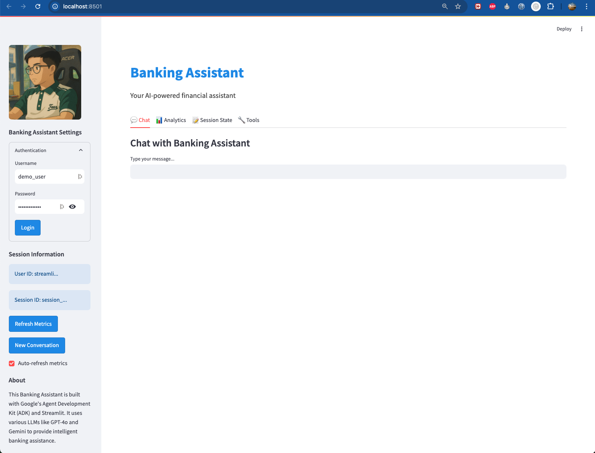
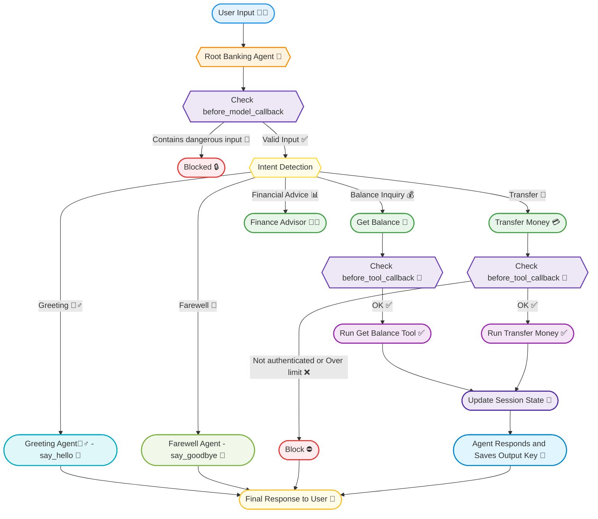

# ADK Banking Bot 🏦



## Overview

ADK Banking Bot is an intelligent banking assistant built using Google's Agent Development Kit (ADK). It leverages a multi-agent architecture to provide comprehensive banking services including account balance inquiries, money transfers, and financial advice.

This project demonstrates how to build enterprise-grade AI applications with ADK, featuring multiple specialized agents, security guardrails, persistent state management, and comprehensive monitoring.

## Features

- **Multi-Agent Architecture**: Specialized agents for different tasks (greetings, farewells, balance inquiries, transfers)
- **Advanced Security**: Input and tool execution guardrails to ensure secure banking operations
- **Session Management**: Persistent state tracking across conversations
- **Comprehensive Monitoring**: Real-time metrics, analytics, and performance tracking
- **Multiple UI Options**: REST API, WebSocket, Web Interface, and Streamlit Dashboard
- **Multi-Model Support**: Flexibility to use different LLMs (GPT-4o, Claude, Gemini) for different agents

## Architecture

The system follows a flowchart-based execution model:



## Project Structure

```
adk-banking-bot/
├── agents/                    # Agent definitions
│   ├── root_agent.py          # Main orchestrator agent
│   ├── greeting_agent.py      # Specialized greeting agent
│   ├── farewell_agent.py      # Specialized farewell agent
│   ├── balance_agent.py       # Balance inquiry agent
│   └── transfer_agent.py      # Money transfer agent
├── tools/                     # Banking tools implementations
│   ├── get_balance.py         # Account balance tool
│   ├── transfer_money.py      # Money transfer tool
│   └── finance_advisor.py     # Financial advice tool
├── callbacks/                 # Security guardrails
│   ├── before_model.py        # Input validation callbacks
│   └── before_tool.py         # Tool execution validation
├── sessions/                  # Session management
│   └── session_service.py     # Session state persistence
├── monitoring/                # Metrics and analytics
│   ├── metrics_collector.py   # Usage metrics collection
│   ├── analytics_service.py   # Data analysis and reporting
│   ├── performance_tracker.py # Performance monitoring
│   ├── alerts.py              # Alerting system
│   ├── logger.py              # Structured logging
│   └── usage_reporter.py      # Usage report generation
├── tests/                     # Comprehensive test suite
│   ├── test_agents/           # Tests for agent modules
│   ├── test_tools/            # Tests for tool implementations
│   ├── test_callbacks/        # Tests for security callbacks
│   ├── test_sessions/         # Tests for session management
│   ├── test_monitoring/       # Tests for monitoring system
│   └── test_api/              # Tests for API endpoints
├── app.py                     # FastAPI backend
├── app_streamlit.py           # Streamlit dashboard
├── runner.py                  # Agent orchestration
├── config.py                  # Configuration management
└── requirements.txt           # Dependencies
```

## Installation

1. Clone the repository
```bash
git clone https://github.com/danglive/adk-banking-bot.git
cd adk-banking-bot
```

2. Create and activate a virtual environment
```bash
python -m venv venv
source venv/bin/activate  # On Windows: venv\Scripts\activate
```

3. Install dependencies
```bash
pip install -r requirements.txt
```

4. Configure API keys
Create a `.env` file with your API keys:
```
OPENAI_API_KEY=your_openai_key_here
GOOGLE_API_KEY=your_google_key_here
ANTHROPIC_API_KEY=your_anthropic_key_here
```

## Running the Application

### FastAPI Backend

```bash
python app.py
```

Visit http://localhost:8000/ui for the simple web interface or http://localhost:8000/docs for API documentation.

### Streamlit Dashboard

```bash
streamlit run app_streamlit.py
```

Visit http://localhost:8501 for the interactive dashboard.

## Docker Deployment

Build and run the Docker container:

```bash
# Build the Docker image
docker build -t adk-banking-bot .

# Run the container
docker run -p 8000:8000 -p 8501:8501 --env-file .env adk-banking-bot
```

## Testing

Run the comprehensive test suite:

```bash
# Run all tests
make test

# Run specific test modules
pytest tests/test_agents

# Generate coverage report
make coverage
```

## Monitoring & Analytics

The system includes extensive monitoring capabilities:

- **Real-time Metrics**: Request counts, latency, success rates
- **Usage Analytics**: Tool usage patterns, user behavior
- **Performance Tracking**: Response times, token usage
- **Alerting**: Automated alerts for anomalies and issues
- **Logging**: Structured logs for debugging and audit

## Key ADK Components

This project showcases several key ADK features:

1. **Multi-Agent System**: Root agent delegates to specialized sub-agents
2. **Tool Integration**: Banking functions as callable tools
3. **Session State**: Persistent conversation memory across turns
4. **Callbacks**: Pre-model and pre-tool safety checks
5. **Multi-Model Support**: Flexibility to use different LLMs

## Author

**Van Tuan Dang**  
Email: vantuandang1990@gmail.com  
GitHub: [danglive](https://github.com/danglive)

## Acknowledgments

- Google's Agent Development Kit (ADK) team
- OpenAI, Anthropic, and Google AI for their LLM APIs
- The Streamlit team for the amazing dashboard framework